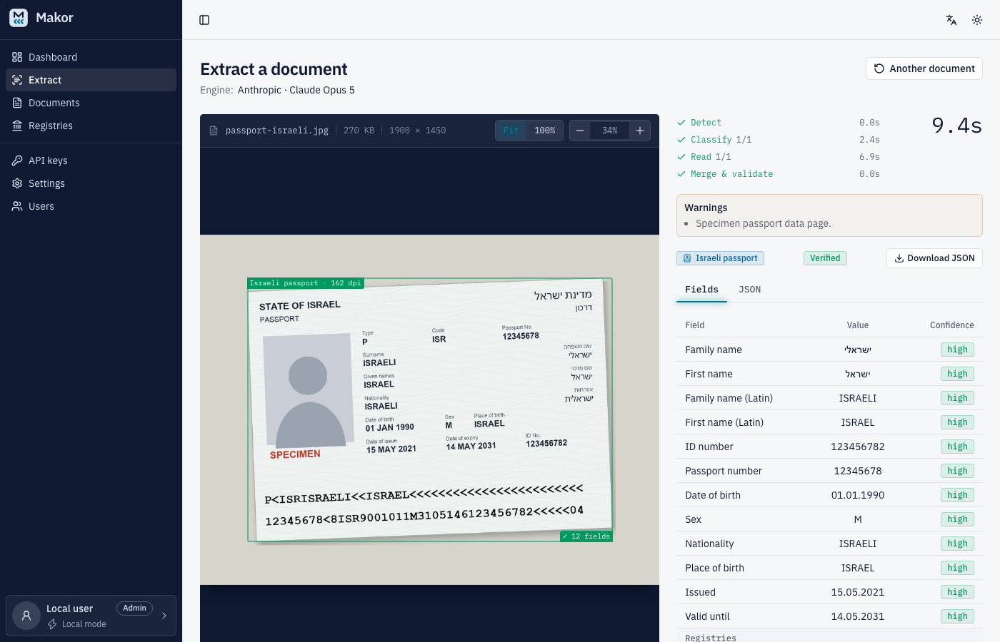
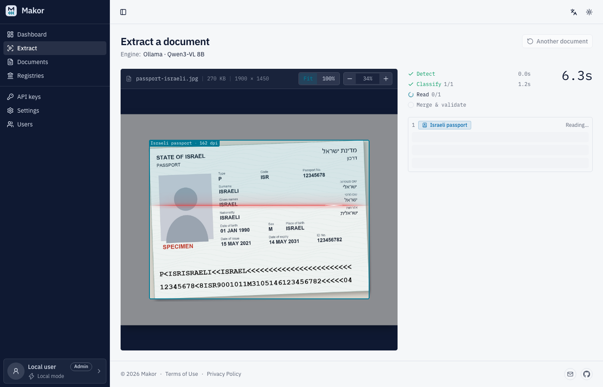
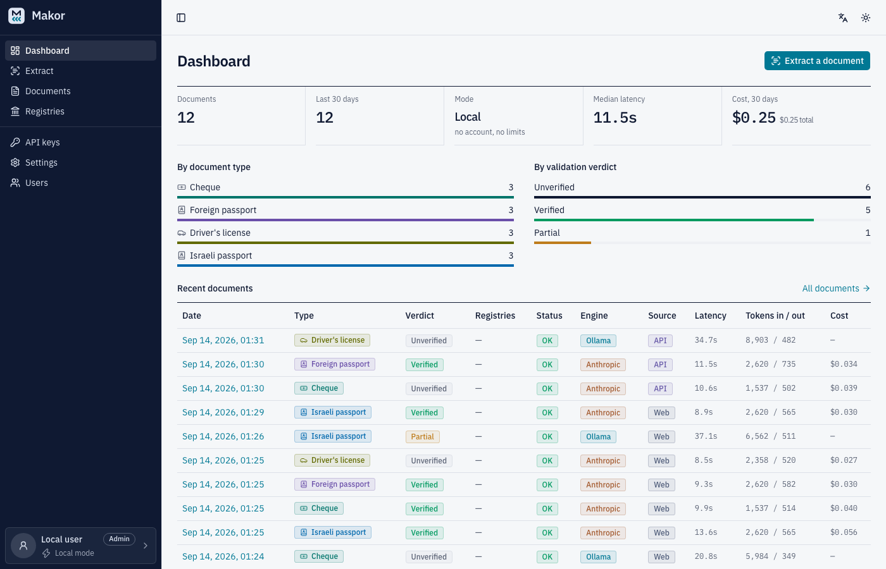
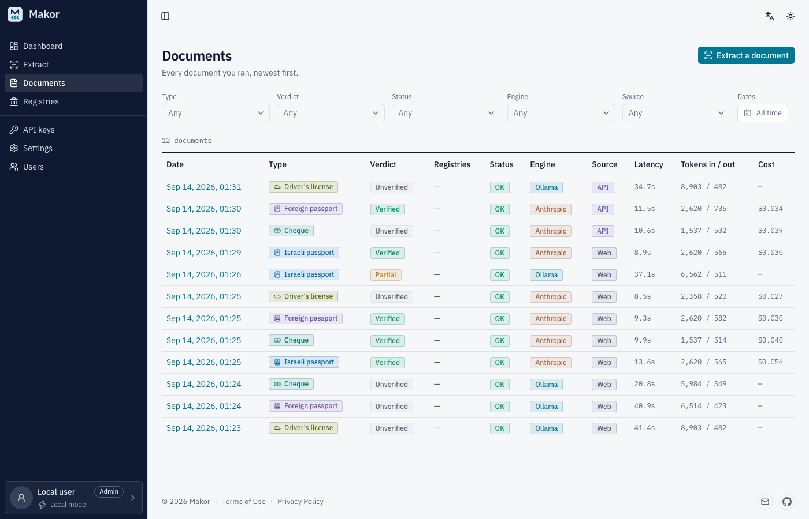
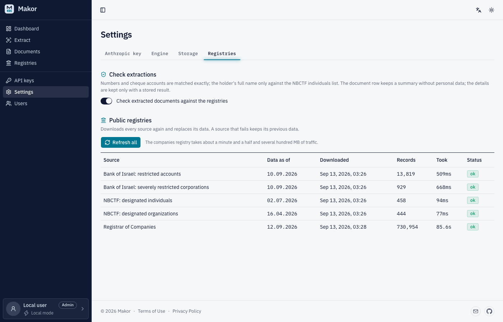
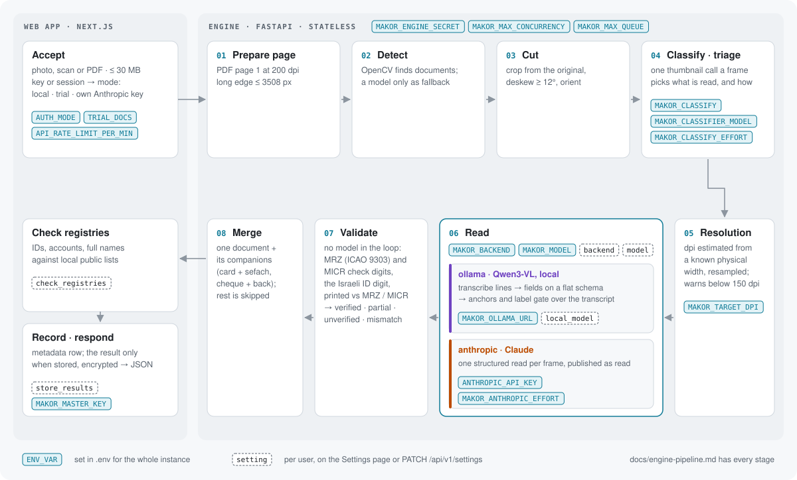
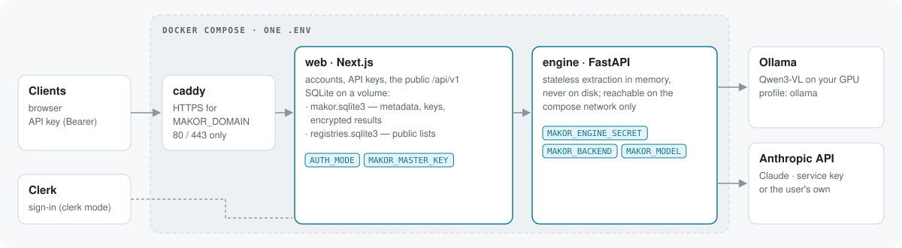

<div align="center">

<h1>
<picture>
  <source media="(prefers-color-scheme: dark)" srcset="web/public/brand/logo-dark.svg">
  
</picture>
<br>
Documents in, JSON out
</h1>

OCR for Israeli identity documents and bank cheques —<br>
Hebrew and Latin fields, check digits verified locally, one API call.

[](LICENSE)
[](engine/)
[](engine/)
[](web/)
[](#backends-and-models)
[](#local-models)
[](web/messages/)
[](#privacy)

[Requirements](#requirements) · [Quick start](#quick-start) · [Configuration](#configuration) · [Deploy](#deploy) · [API](docs/api.md) · [How it works](#how-it-works)

<br>

<picture>
  <source media="(prefers-color-scheme: dark)" srcset="docs/screenshots/extract-result-dark.png">
  
</picture>

</div>

A photo, scan or PDF goes in; typed fields with per-field confidence, the documents' regions
and a validation verdict come out. The verdict is local math — MRZ and MICR check digits, the
Israeli ID digit, printed-vs-machine-read cross-checks — never the model's opinion. Run it in
the cloud with Claude, or on your own GPU with Ollama, where nothing leaves the machine.

## What it reads

| Document | Key fields | Verified by |
|---|---|---|
| Teudat zehut — both card layouts, the back, the sefach | names, ID, dates, address, spouse, children | ID check digit, the back's TD1 MRZ |
| Israeli passport | names in both scripts, passport number, ID, dates | TD3 MRZ check digits + cross-checks |
| Foreign passport, any country | Latin names, passport number, nationality, dates | TD3 MRZ check digits + cross-checks |
| Driver's licence | licence number (4d), ID (5), address (8), categories (9) | ID check digit |
| Disability card | names, ID, file number, validity month | ID check digit |
| Bank cheque, front and back | bank, branch, account, number, drawer, payee, amount, date | MICR line, amount in words, ח.פ. / ID digits |

Every extraction can also be **checked against Israeli public registries** — the Bank of
Israel's restricted accounts, the NBCTF terror designation lists and the Registrar of
Companies — which the app downloads and searches locally.

<table>
  <tr>
    <td width="50%" align="center"><picture><source media="(prefers-color-scheme: dark)" srcset="docs/screenshots/extract-reading-dark.png"></picture><br><sub>The engine reading live</sub></td>
    <td width="50%" align="center"><picture><source media="(prefers-color-scheme: dark)" srcset="docs/screenshots/dashboard-dark.png"></picture><br><sub>Dashboard</sub></td>
  </tr>
  <tr>
    <td width="50%" align="center"><picture><source media="(prefers-color-scheme: dark)" srcset="docs/screenshots/documents-dark.png"></picture><br><sub>Documents — metadata only, never the image</sub></td>
    <td width="50%" align="center"><picture><source media="(prefers-color-scheme: dark)" srcset="docs/screenshots/settings-registries-dark.png"></picture><br><sub>Public registries</sub></td>
  </tr>
</table>

## How it works

<picture>
  <source media="(prefers-color-scheme: dark)" srcset="docs/diagrams/pipeline-dark.svg">
  
</picture>

- **Nothing is read blind.** OpenCV finds each document; one thumbnail call a frame decides
  whether and how it is read, so a page with no document costs at most one call.
- **Full resolution.** Every document is cut from the original image, deskewed and oriented
  per crop, and resampled to 300 dpi from an estimate of its physical size.
- **Two readers, one schema.** Ollama transcribes the lines first, then fills a flat schema
  over image + transcript, with deterministic anchors correcting the small model. Claude reads
  each frame in one structured call. Both are constrained to the same Pydantic schemas.
- **Validation is math.** Hebrew names come only from the print, Latin names only from the
  MRZ — never transliterated — and a check that could not run never reads as passed.

Every stage, its thresholds and the reasons behind them: [`docs/engine-pipeline.md`](docs/engine-pipeline.md).

## Requirements

| | Local · Ollama | Local · Claude | Server · cloud | Server · self-host |
|---|---|---|---|---|
| **OS** | macOS on Apple silicon, or Linux | macOS or Linux | Linux | Linux |
| **Software** | Python 3.14, Node 24 + npm 11, [Ollama](https://ollama.com) | Python 3.14, Node 24 + npm 11 | Docker with Compose v2 | Docker with Compose v2, NVIDIA driver + nvidia-container-toolkit |
| **CPU · RAM** | ~10 GB free for the 8B model, 32 GB for the 30B | any recent machine | 2 vCPU · 4 GB measured ample (2 GB with swap by estimate) | 4+ vCPU · 16 GB *(estimate)* |
| **GPU** | Apple silicon or NVIDIA | — | — | NVIDIA, ≥ 8 GB VRAM for the 8B, ~24 GB for the 30B *(estimate)* |
| **Disk** | 6 GB for the 8B (19.6 GB for the 30B), ~1 GB registries | ~1 GB registries | ~3 GB: 1.3 GB images, ~0.5 GB registries, plus the OS and swap | ~2 GB + the Ollama image and models |
| **Network** | outbound to the registries (optional) | + `api.anthropic.com` | a domain's A record, inbound 80/443 (+ 22 for the deploy workflow); outbound to Anthropic, Clerk, GHCR, the registries | a domain, inbound 80/443; outbound to the registries |
| **Accounts** | — | an Anthropic API key | an Anthropic API key, a Clerk application | — |

- **Speed.** The 8B model takes about 47 s a document on an M5 and reads one request at a
  time; Claude takes 5–20 s and runs requests in parallel.
- **Registries** download from `mugbalim.boi.org.il`, `nbctf.mod.gov.il` and `data.gov.il`: the
  companies registry is several hundred MB of traffic, and the file settles near 1 GB.
  Everything else works without them.
- **What is measured.** The local columns are measured on Apple silicon. The cloud server column
  is measured on a 2 vCPU / 4 GB Linux server running the production stack: the engine peaked
  near 870 MB with four 48 MP document photos at once and the web app near 420 MB during a
  registries refresh, with swap never touched. The NVIDIA figures are estimates from the models'
  weights. `scripts/run.sh` is bash, so Windows
  means WSL2 or Docker — untested.

## Quick start

Your own machine, no sign-in, a local model — the first column above.

```bash
git clone https://github.com/yanfishel/makor.git && cd makor
python3 -m venv .venv && .venv/bin/pip install -r engine/requirements.txt
.venv/bin/pip install --no-deps rapidocr-onnxruntime==1.2.3   # a separate step on purpose
ollama pull qwen3-vl:8b-instruct
cp .env.example .env && scripts/run.sh dev local              # engine :8000 + web :3000
```

Open <http://localhost:3000/app/extract> and drop a document, or:

```bash
curl -s -X POST http://localhost:3000/api/v1/extract -F "file=@document.jpg" | jq
```

`scripts/run.sh <dev|prod> <local|clerk> [--check]` names any variable the variant is missing
(with the command that generates it), checks Ollama and the model, and logs to `data/logs/`;
`scripts/stop.sh` frees the ports. For Claude instead, set `MAKOR_BACKEND=anthropic` and
`ANTHROPIC_API_KEY`.

## Configuration

One git-ignored `.env` at the root serves both apps — `scripts/run.sh` and `docker compose`
read it. Copy [`.env.example`](.env.example); its comments carry the generate commands.

| Variable | Default | Needed | What it does |
|---|---|---|---|
| **Shape** | | | |
| `AUTH_MODE` | `clerk` (compose) · set by the `run.sh` variant | always | `clerk` = invite-only multi-user cloud · `none` = one local user, no sign-in |
| `MAKOR_DOMAIN` | — | compose | Public hostname; Caddy gets its certificate. `localhost` for a local smoke test |
| `NEXT_PUBLIC_SITE_URL` | `https://$MAKOR_DOMAIN` · `http://localhost:3000` (run.sh) | — | The origin printed in the app's curl snippets |
| **Secrets** | | | |
| `MAKOR_ENGINE_SECRET` | — | compose, prod, `clerk` | Web ↔ engine shared secret (`openssl rand -hex 32`); a prod engine refuses to start without it |
| `MAKOR_MASTER_KEY` | generated in `none` | `clerk` | Encrypts stored results and users' Anthropic keys (`openssl rand -base64 32`) |
| **Extraction** | | | |
| `MAKOR_BACKEND` | `anthropic` (compose) · `ollama` (run.sh) | — | Which reader the engine uses; a self-hosted user can switch it in settings |
| `MAKOR_MODEL` | `claude-opus-5` · `qwen3-vl:8b-instruct` | — | The backend's default model; users override it in settings |
| `ANTHROPIC_API_KEY` | — | `anthropic` | The service's key: trial documents in `clerk`, everything in `none` |
| `MAKOR_CLASSIFY` | `on` | — | `off` reads every detected region without the thumbnail classifier |
| `MAKOR_CLASSIFIER_MODEL` | `MAKOR_MODEL` | — | Keep the default: a cheaper model classes a stamped cheque as nothing |
| `MAKOR_CLASSIFY_EFFORT` | `low` | — | The classifier's effort on Anthropic; empty = the API default |
| `MAKOR_OLLAMA_URL` | `http://ollama:11434` · `localhost` | — | Only for an Ollama on another host |
| **Limits** | | | |
| `TRIAL_DOCS` | `5` | — | Free documents per cloud account before its own Anthropic key is needed |
| `API_RATE_LIMIT_PER_MIN` | `30` | — | Requests a minute per API key on `/api/v1/*` (`0` = off) |
| `API_SEARCH_RATE_LIMIT_PER_MIN` | `20` | — | The same for the registries search |
| `MAKOR_REGISTRIES_REFRESH_AT` | `03:30` (compose and `.env.example`) · off when unset or empty | — | Israeli time (`HH:MM`) of the daily registries refresh; empty = only *Refresh all* |
| `ENGINE_TIMEOUT_MS` | `600000` | — | How long the web app waits; the engine queues requests |
| **Clerk** | | | |
| `CLERK_PUBLISHABLE_KEY`, `CLERK_SECRET_KEY` | — | `clerk` | From the [Clerk dashboard](https://dashboard.clerk.com) |
| `MAKOR_ADMIN_EMAIL` | — | `clerk` | Invited as the first admin while the instance has none |
| **Deploy** | | | |
| `MAKOR_TAG` | `latest` | — | The image tag compose runs; the deploy workflow writes the release into the server's `.env` |

- A container sees only what its `environment:` in [`docker-compose.yml`](docker-compose.yml)
  lists: a new variable needs its line there too.
- Every other engine knob (`MAKOR_MAX_CONCURRENCY`, `MAKOR_MAX_QUEUE`, `MAKOR_TARGET_DPI`,
  `MAKOR_ANTHROPIC_EFFORT`, `MAKOR_OLLAMA_KEEP_ALIVE` — which compose pins to `-1`) has its
  default and its reason in [`engine/app/config.py`](engine/app/config.py). `scripts/run.sh`
  also reads `ENGINE_PORT` / `WEB_PORT`; a bare `npm run dev` reads
  [`web/.env.example`](web/.env.example)'s variables from `web/.env`.

Per-user settings — store results, check registries, backend, model, local model — live on
the Settings page and in [`/api/v1/settings`](docs/api.md#settings).

## Deploy

<picture>
  <source media="(prefers-color-scheme: dark)" srcset="docs/diagrams/architecture-dark.svg">
  
</picture>

What the server needs is in [Requirements](#requirements).

```bash
cp .env.example .env    # MAKOR_DOMAIN, MAKOR_ENGINE_SECRET, MAKOR_MASTER_KEY, ANTHROPIC_API_KEY, CLERK_*, MAKOR_ADMIN_EMAIL

# Cloud: Clerk sign-in, Claude
docker compose up -d --build

# Self-host: no sign-in, Ollama on an NVIDIA host
AUTH_MODE=none MAKOR_BACKEND=ollama docker compose --profile ollama up -d --build
docker compose exec ollama ollama pull qwen3-vl:8b-instruct   # once; the model lives in a volume

curl -si https://$MAKOR_DOMAIN/api/v1/usage   # 401 (clerk) or 200 (none) = the stack is up
```

- **Only Caddy is published** (80/443, no access log); inbound, allow nothing else but SSH (the
  deploy workflow connects from GitHub's changing addresses). Docker's published ports bypass
  `ufw`, so a provider-level firewall is the safer place for that rule. The engine is on the
  compose network only, the SQLite files on the `web_data` volume.
- **Invite-only sign-up.** In the Clerk dashboard set *Configure → Restrictions → Sign-up mode
  → Invite-only* once. While the instance has no admin, the web app invites
  `MAKOR_ADMIN_EMAIL` on start; that admin invites everyone else from *Users → Invitations*.
- **Registries** are empty until the first daily refresh (`MAKOR_REGISTRIES_REFRESH_AT`, 03:30
  Israeli time by default) or until an admin presses *Settings → Registries → Refresh all* (the
  companies registry takes about a minute and a half). Then *check* sends every extraction
  through them.
- **On a Mac**, run Ollama natively — the container has no Metal — and use `scripts/run.sh`.
- **Deploy on release** ([`.github/workflows/deploy.yml`](.github/workflows/deploy.yml)). Every
  pull request and push to `main` runs the engine and web tests; nothing deploys until a
  release is published (`gh release create v1.2.0 --generate-notes`, pre-releases excluded).
  The release runs the tests on its tag, builds both images, pushes them to GHCR as
  `makor-engine` / `makor-web` tagged with the release, the commit and `latest`, and deploys over
  SSH as the server's `deploy` user: it copies `docker-compose.yml` and the Caddyfile to
  `/srv/makor`, writes the release into `MAKOR_TAG` in the server's `.env`, pulls, restarts and
  checks that `/api/v1/usage` answers 401. The deploy job runs in the `production` environment,
  which holds the `DEPLOY_*` secrets, accepts only `v*` tags and waits for the maintainer's
  approval (*Review deployments*, or `gh api` on the pending run). The server builds nothing and its `.env` never
  leaves it. The workflow needs the secrets `DEPLOY_HOST`, `DEPLOY_SSH_KEY`,
  `DEPLOY_KNOWN_HOSTS` and the variable `MAKOR_DOMAIN`. **Roll back** by running the workflow by
  hand on an earlier release's tag (*Actions → Test and deploy → Run workflow*, `gh workflow run
  deploy.yml --ref v1.1.0`); run on a branch it only tests.
- **A server for the deploy workflow** needs, once: Docker with Compose v2; a `deploy` user in the
  `docker` group whose `authorized_keys` holds the public half of `DEPLOY_SSH_KEY`;
  `/srv/makor/.env` written by hand (the workflow never sends secrets); a swapfile on a small
  machine. The smoke check expects clerk mode's 401. The image names are
  `ghcr.io/yanfishel/makor-*`: a fork publishing its own images changes them in
  `docker-compose.yml` and `deploy.yml`, and a plain `docker compose up` without `--build`
  pulls whatever those names hold.

## API

Create a key under **API keys** (shown once) and send it as a bearer token:

```bash
curl -s -X POST https://<your host>/api/v1/extract \
  -H "Authorization: Bearer ak_…" \
  -F "file=@document.jpg" -F "check_registries=true" | jq
```

| Endpoint | |
|---|---|
| `POST /api/v1/extract` | Read a document → fields, validation, regions, warnings, registries check |
| `GET /api/v1/documents` · `/:id` | Metadata list · a stored result |
| `DELETE /api/v1/documents` · `/:id` | Delete stored results |
| `GET /api/v1/usage` | Mode, trial counters, totals |
| `GET /api/v1/registries/search` | Search the registries by number, account or name |
| `GET` · `PATCH /api/v1/settings` | Read and change the key owner's settings |

```json
{
  "document_type": "israeli_passport",
  "fields": { "id_number": { "value": "123456782", "confidence": "high" }, "…": {} },
  "validation": { "mrz_checksums_valid": true, "overall": "verified" },
  "registries": { "checked": ["id_number", "name_he", "name_en"], "matches": [] }
}
```

The full reference — every field, limit, error code and a cheque example — is
[`docs/api.md`](docs/api.md), and a running instance serves it at `/api-reference`.

## Backends and models

| Backend | Model | Cost / document | When |
|---|---|---|---|
| `anthropic` | `claude-opus-5` (cloud default) | ≈ $0.02–0.05 | best quality, recommended |
| `anthropic` | `claude-sonnet-5` | ≈ $0.01 | balanced |
| `anthropic` | `claude-haiku-4-5` | ≈ $0.004 | high volume |
| `ollama` | `qwen3-vl:8b-instruct` (local default) | free | privacy-first, offline |
| `ollama` | `qwen3-vl:30b-a3b-instruct` | free | cheques and passports, 32 GB RAM |

Anthropic's prompt cache is per API key, so a user bringing their own key at low traffic pays
the cache write on most requests.

### Local models

Pick one under *Settings → Local model*; a model not yet pulled is greyed out with its pull
command beside it. Switching costs about 24 s on the next extraction while Ollama swaps weights.

| Model | Download | RAM | What to expect |
|---|---|---|---|
| `qwen3-vl:8b-instruct` | 6 GB | ~10 GB | the tuned default — every safeguard in the engine is tuned on it; ~47 s a document on an M5 |
| `qwen3-vl:30b-a3b-instruct` | 19.6 GB | 32 GB | recommended for cheques and passports, experimental for ID cards: better on cheques and foreign MRZs, faster on single-document pages, 1.2–2.9× slower on cards and multi-document pages; on old laminated cards its transcription loops and parents, sex and place of birth stay empty |

Ollama must run on the GPU (`ollama ps` shows `100% GPU`) — on Apple silicon the arm64 build;
the Intel build runs on the CPU about ten times slower. What neither model reads correctly, and
what is untested: [`docs/known-gaps.md`](docs/known-gaps.md).

<details>
<summary><code>ollama pull</code> stalls or fails its hash check</summary>

Fetch the blob by hand: download
`registry.ollama.ai/v2/library/qwen3-vl/blobs/sha256:<digest>` (the digest is in the pull's
output), verify its sha256, save it as `~/.ollama/models/blobs/sha256-<digest>`, and run
`ollama pull` again.

</details>

## Privacy

- **Images are never stored**: read in memory (an upload over 1 MB spools to a temporary file
  deleted when the request ends), and the engine keeps no state. Logs carry
  ids, status codes, token counts and timings — never prompts, images or values.
- **Per document the app keeps metadata only** — time, type, verdict, model, tokens, latency,
  cost and a value-free registries summary; no filename, size or hash. The result JSON is kept
  only with *store results* on, encrypted with `MAKOR_MASTER_KEY`, and deletable.
- **The cloud sends every document to the Anthropic API**, and sign-in runs on Clerk, both in
  the US. Self-hosted with Ollama, nothing leaves your machine.
- Document photos are sensitive personal data under the Israeli Privacy Protection Law
  (Amendment 13). A hosted instance publishes `/terms` and `/privacy` in English and Hebrew.

## Development

```bash
.venv/bin/pip install -r engine/requirements-dev.txt                       # pytest + ruff on top of the runtime deps
cd engine && ../.venv/bin/pytest tests/ -q && ../.venv/bin/ruff check .    # unit tests (no model calls) + lint
cd web && npm test && npm run lint && npm run typecheck && npm run build   # vitest + eslint + tsc + build
cd web && npm run e2e                                                      # Playwright against scripts/run.sh dev local
cd engine && ../.venv/bin/python scripts/eval.py ../samples --url http://127.0.0.1:8000   # a corpus run over your own documents
```

```
engine/   FastAPI extraction engine — app/ (pipeline, readers, validation), tests/, scripts/
web/      Next.js app — app/ routes, components/, lib/ (handlers, registries, db), messages/ en + he
deploy/   Caddyfile
.github/  workflows: tests on every PR and push, images + deploy on a published release, @claude, Claude review on a label
scripts/  run.sh, stop.sh
docs/     the references below, screenshots, diagrams
```

| Document | For |
|---|---|
| [`CLAUDE.md`](CLAUDE.md) | the project's rules and invariants — read first |
| [`docs/engine-pipeline.md`](docs/engine-pipeline.md) | every pipeline stage, before touching `engine/app/` |
| [`docs/web-app.md`](docs/web-app.md) | UI system, routes, handlers, data model, deployment files |
| [`docs/api.md`](docs/api.md) | the public API |
| [`docs/known-gaps.md`](docs/known-gaps.md) | misreads code does not fix, what is untested |

Test documents live in the git-ignored `samples/`, which is not published: `eval.py` and the e2e
extraction need documents of your own, and code, tests, docs, issues and pull requests use
synthetic values only (see [`CLAUDE.md`](CLAUDE.md) → *Privacy*). The repository is published to
read, fork and self-host: issues, pull requests and comments are open to the maintainer only.
Questions and reports go to the contact address; vulnerabilities as [`SECURITY.md`](SECURITY.md) says.

## License

[MIT](LICENSE) © 2026 Yan Fishel. The model weights and APIs the engine calls (Qwen3-VL via
Ollama, the Anthropic API) come under their own licences and terms, and the public registries
under their publishers' terms. Makor is an independent project, not affiliated with any Israeli
government authority or bank.
